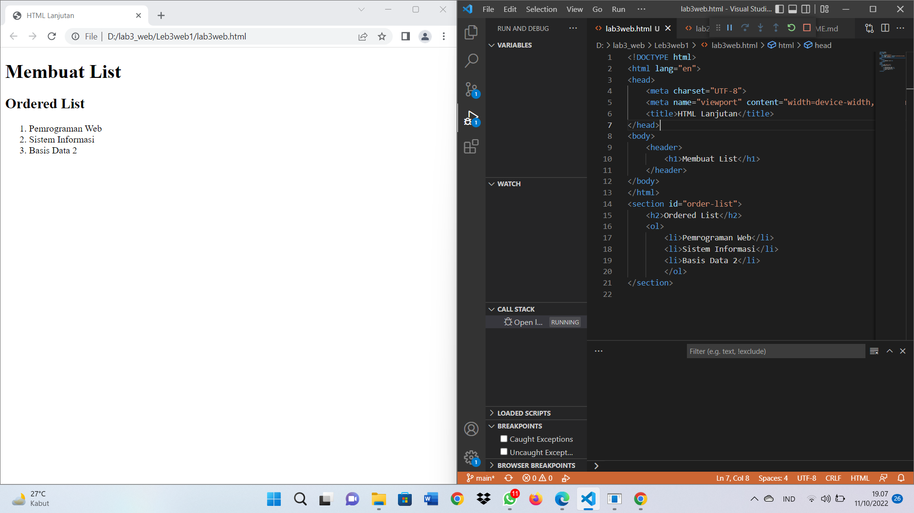
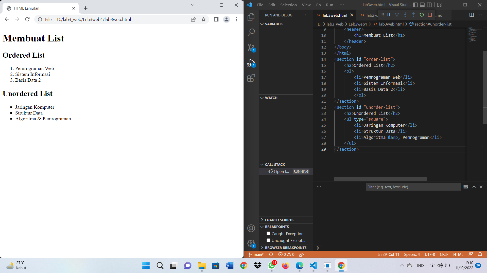
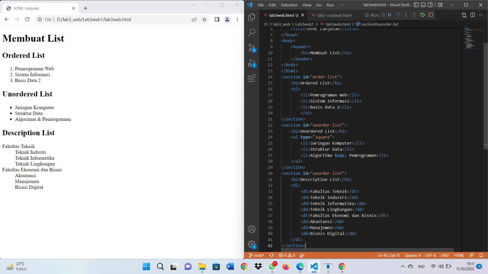
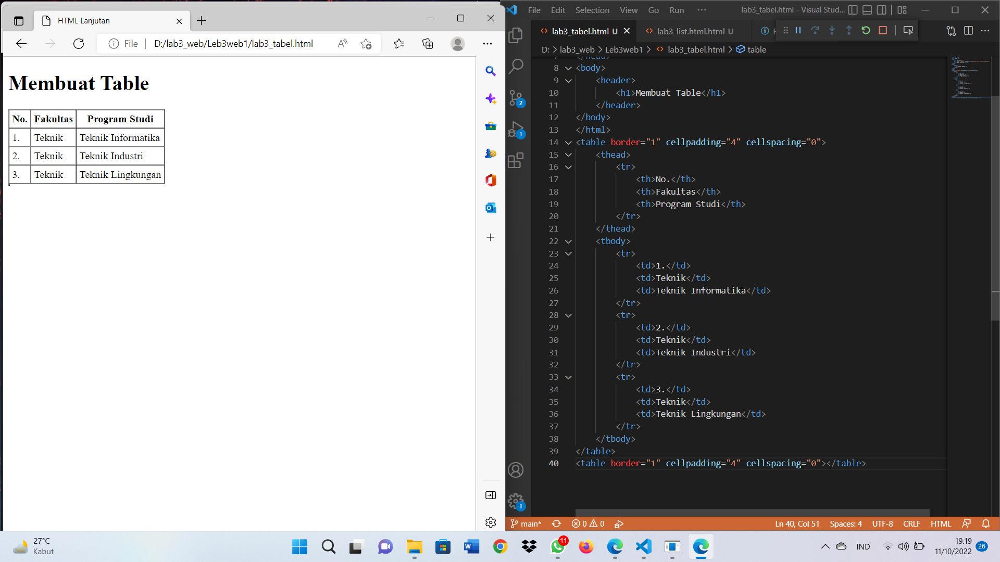
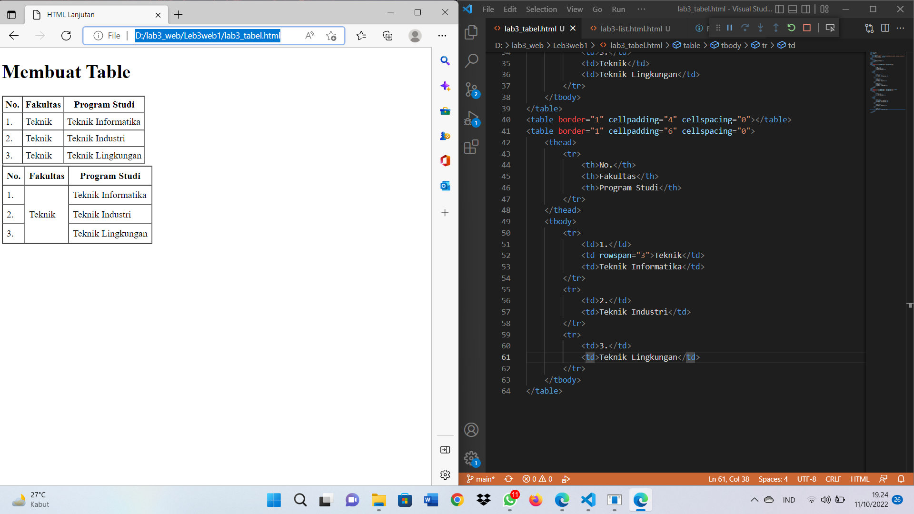
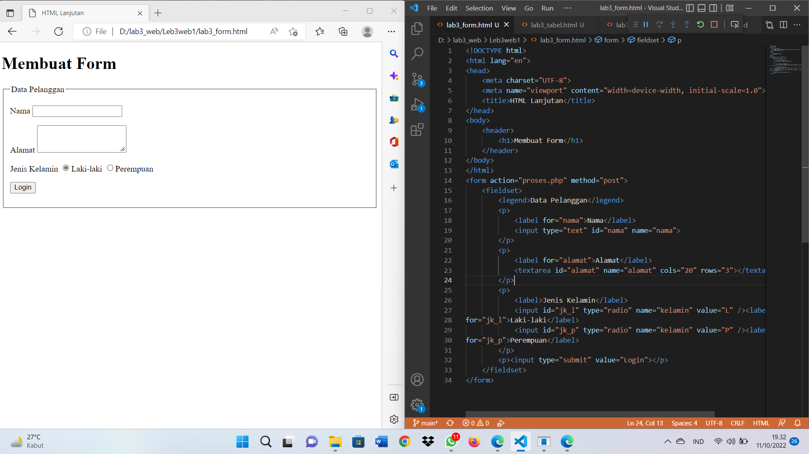
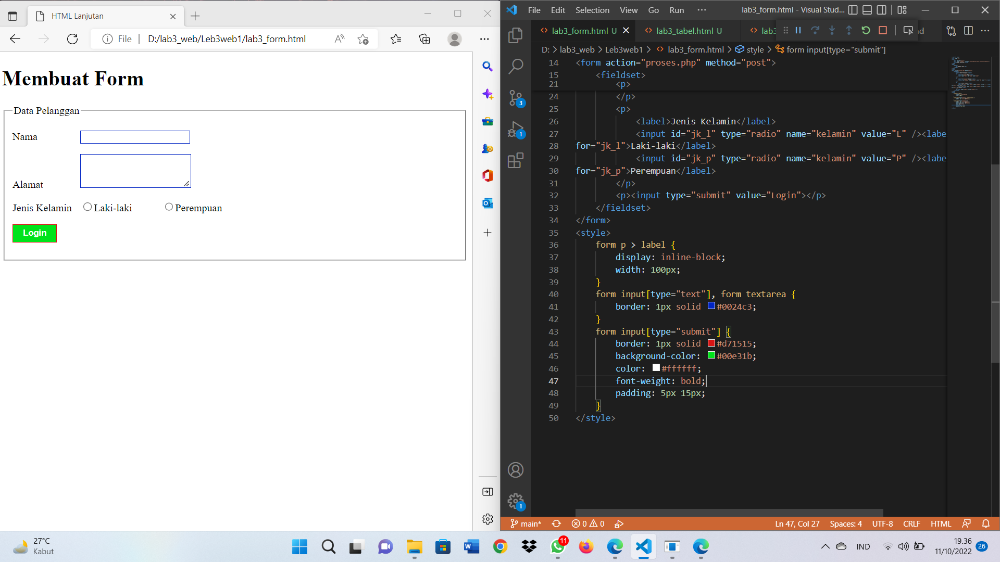
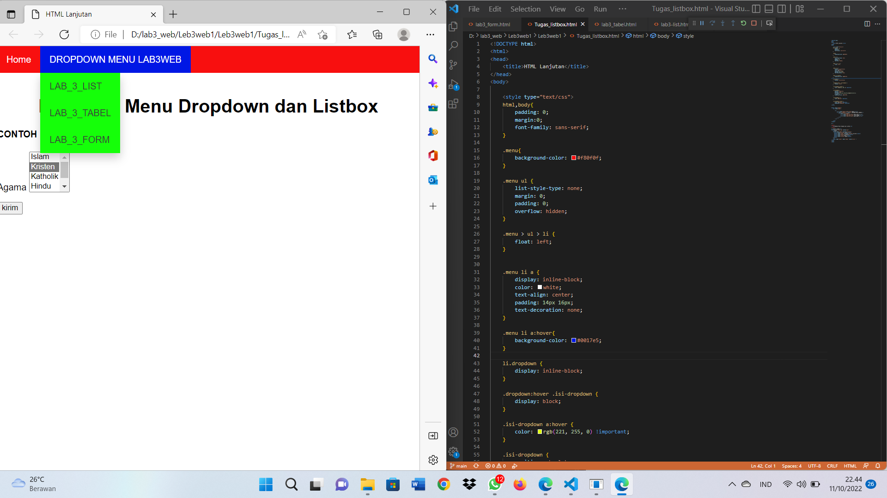
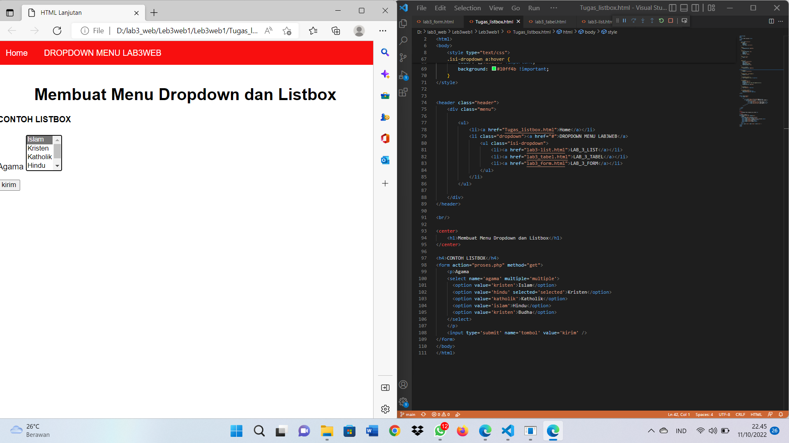

# Lab3web
# Praktikum 3 
# Risyad Bima Nugraha
# 312110039
# TI.21.B1
# Universitas Pelita Bangsa
# LANGKAH 1
# Membuat dokumen HTML dengan nama file lab3_list.html dan Membuat Ordered list

# LANGKAH 2
# Membuat Unordered List

# LANGKAH 3
# Membuat Description List

# LANGKAH 4
# Membuat file HTML baru dan membuat tabel

# LANGKAH 5
# Menggabungkan sel Data dan Mengatur magrin tabel

# LANGKAH 6
# Membuat file HTML baru,Membuat form dan membuat tabel

# LANGKAH 7
# Menambahkan css agar lebih menarik

# Pertanyaan Dan Tugas
# Membuat form yang menampilkan dropdown menu dan listbox dengan multiple selection.
# Membuat Dropdown Menu

# Membuat Listbox Dengan Multiple Selection

